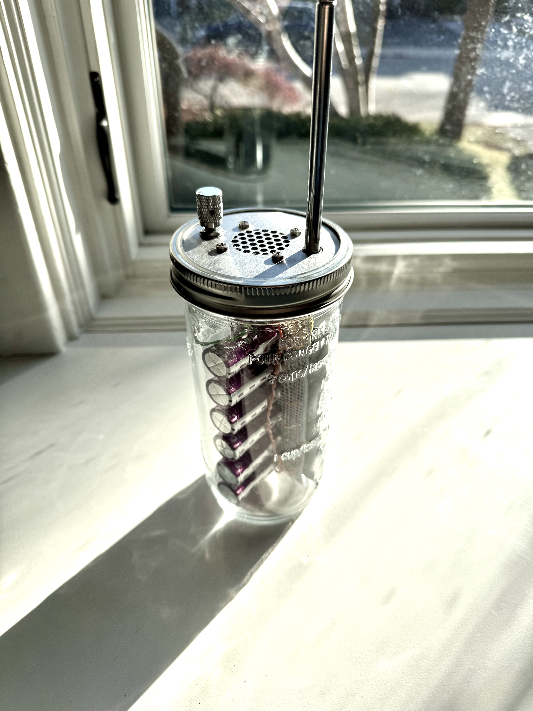
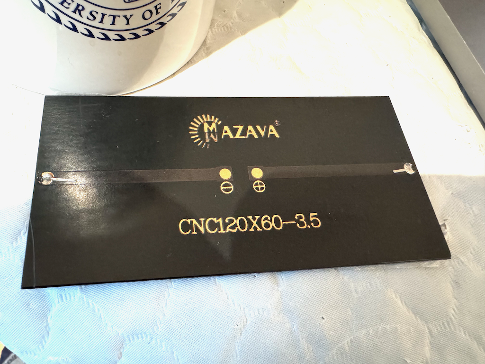
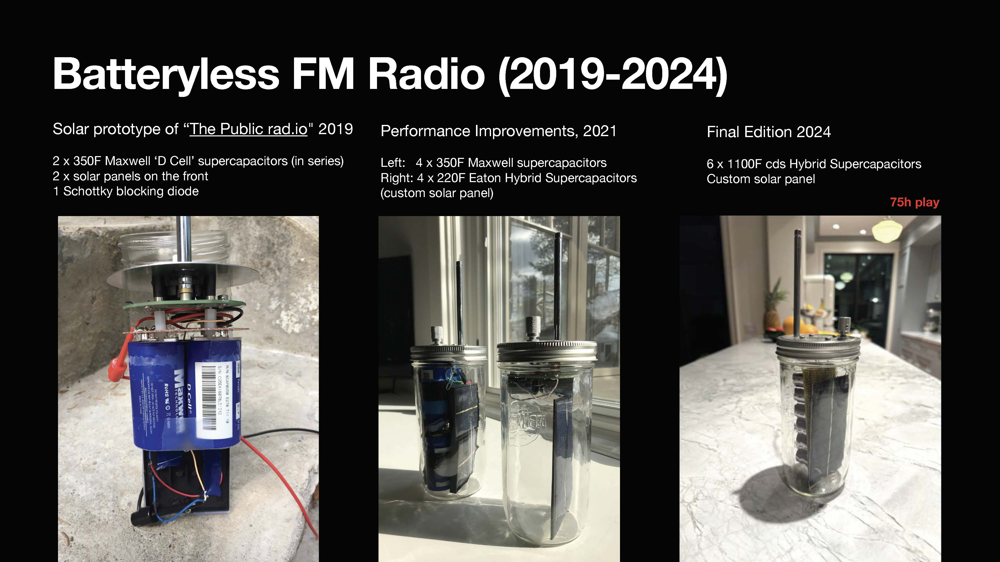

<!DOCTYPE html>
<h1>Batteryless FM Radio in a Mason Jar</h1>

<a href="README.md"> ⬆️</a> | <a href="MasonJarRadio.md#Introduction">Introduction</a> | <a href="MasonJarRadio.md#partslist">Parts Required</a> | <a href="MasonJarRadio.md#assembly">Assembly</a>

<h1 id="introduction">Introduction</h1>                                                                         

<a href="https://thepublicrad.io">The Public Rad.io</a> is a single station FM Tuner in a Mason jar <a href="https://github.com/The-Public-Radio">open source project</a> by Zach Dunham and Spencer Wright <a href="https://www.kickstarter.com/projects/centerlinelabs/kickstarter-gold-the-public-radio-the-single-stati?ref=44759g">crowdfunded on Kickstarter</a> into being.
Their blog discusses how they used the mason jar just because they had one handy and needed to test the speakers for their radio design, but the general benefit is that it in choosing an established standard for packaging goods, <a href="https://en.wikipedia.org/wiki/Mason_jar">since 1858</a>, it is easy to change the container for the radio.  Note that it isn't actually a single station radio, it is possible for a user to change the station by unscrewing the jar and hitting the seek button. Few listeners are actually station-hoppers, though: most prefer to return to their favourite station and programming.

 

<h1 id="partslist">Parts Required</h1> 
<ul>
  <li><a href="https://thepublicrad.io">The Public Rad.io</a> is available from their website, or the plans for manufacturing them are on Github.  I would recommend getting an extra antenna, as the longer mason jar is more prone to tipping and the antenna usually suffers.  The power regulator on the board is well designed, it will cut off power to the radio to keep the hybrid supercapacitors from discharging past 2.2V</li>
  <li>120x60 3.5V solar panel - <a href="solarcell_oc.png">produces about 4.2 to 4.3 V open circuit (no load)</a></li>
  <li>Schottky Diode e.g. IN4004 - this causes a voltage drop of only 0.3 - 0.4V and reduces the voltage from the panel's open circuit 4.2V to 3.9 or 3.8V, protecting the hybrid supercapacitor from overcharging.  It also prevents the hybrid supercapacitor charge from flowing back into the solar panel when it's not in daylight.</li>
  <li>Electronic protoboard like the <a href="https://www.adafruit.com/product/590">Adafruit Full Size PCB</a>.  We will use the busses that run along the length of the boards to wire the hybrid supercapacitors/lithium ion capacitors in parallel
  <li>~1000 Farad Hybrid Supercapacitors also known as Lithium Ion Capacitors - available from <a href="https://en.cda-cap.com/">cds of Taiwan</a> via <a href="https://www.aliexpress.com/item/1005005413033296.html">Aliexpress</a> or <a href="https://www.farnell.com/datasheets/4422020.pdf">Eaton Electronics</a> via <a href="https://ie.farnell.com/eaton-electronics/hsh1850-3r8108-r/super-cap-hs-hybrid-1000f-3-8v/dp/4575000">Farnell</a> in large sizes.
</ul>
<h1 id="assembly">Assembly</h1> 

We begin by removing the AA battery clips and soldering in a positive red wire and a negative black wire.   Although this radio uses a small amount of current, using large wires with low power sources has been shown to have a benefit and it supports the longevity of the device.

 

The solar cell we will use is this one, it is rated for 3.5V but <a href="https://github.com/bksutherland/GreenTechHackathon/blob/main/solarcell_oc.png">in full sun it will produce 4.2V</a>.  When solar cells are used to charge supercapacitors, they always charge to the open circuit voltage, not the rated voltage, due to the lack of resistance which capacitors offer compared with batteries.

 

The purple cylinders are hybrid supercapacitors made by cds of Taiwan.  Eaton electronics will have <a href="http://www.farnell.com/datasheets/4422020.pdf">1400F capacitors out by 2025 (thanks, Niall!)</a>.
Each hybrid supercapacitor stores about 6 000 J as it charges to 4V then discharges to 2.2V. 
Joules = 1/2 C V ^2 (Charged) - 1/2 C V ^2 (Discharged) -  
0.5 x 1100F x 4V^2 - 0.5 x 1100F x 2.2V^2 
8800 - 2682 J 
6118 J 

Hybrid supercapacitors ship fully charged, usually with the long foot (positive voltage) in a plastic tube.  As they can discharge MUCH faster than batteries when they short circuit, it is important in handling them to take special care as a significant heating occurs across the leads for anything conductive.  A short circuited hybrid supercapacitor will spontaneous melt a line of solder, or make a wire glow red and melt the plastic insulation for example.  So proper handling!  Doesn't go in a pocket with change, for example. :)

A single 1100F hybrid supercapacitor will power The Public Rad.io for about 15h at medium volume.  Having six of them wired in parallel will ensure listening for an entire day and a week without a sunny days with the opportunity to recharge from the panel.

 

 

 

 

</html>
