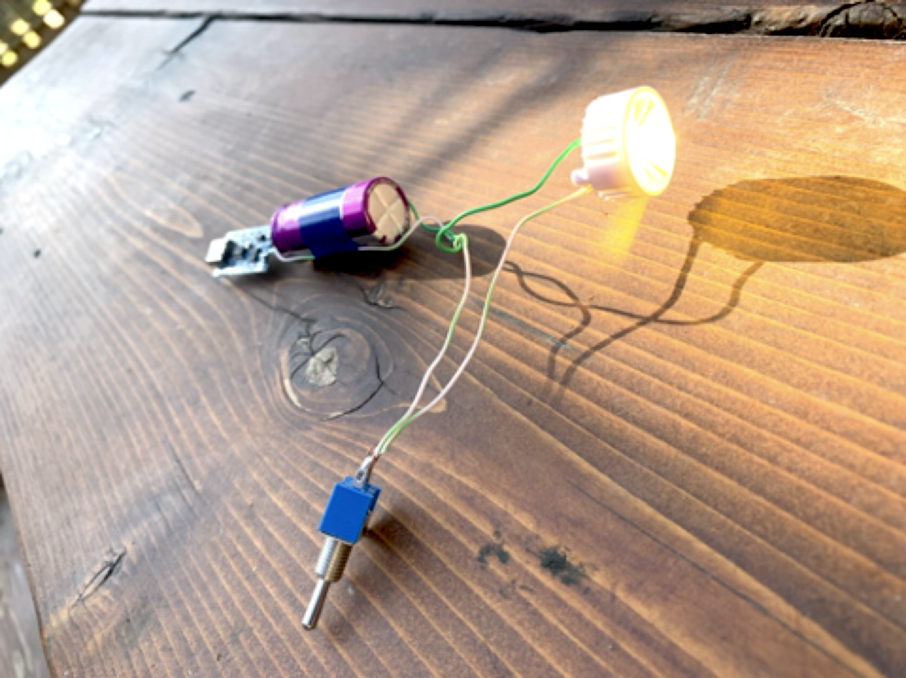
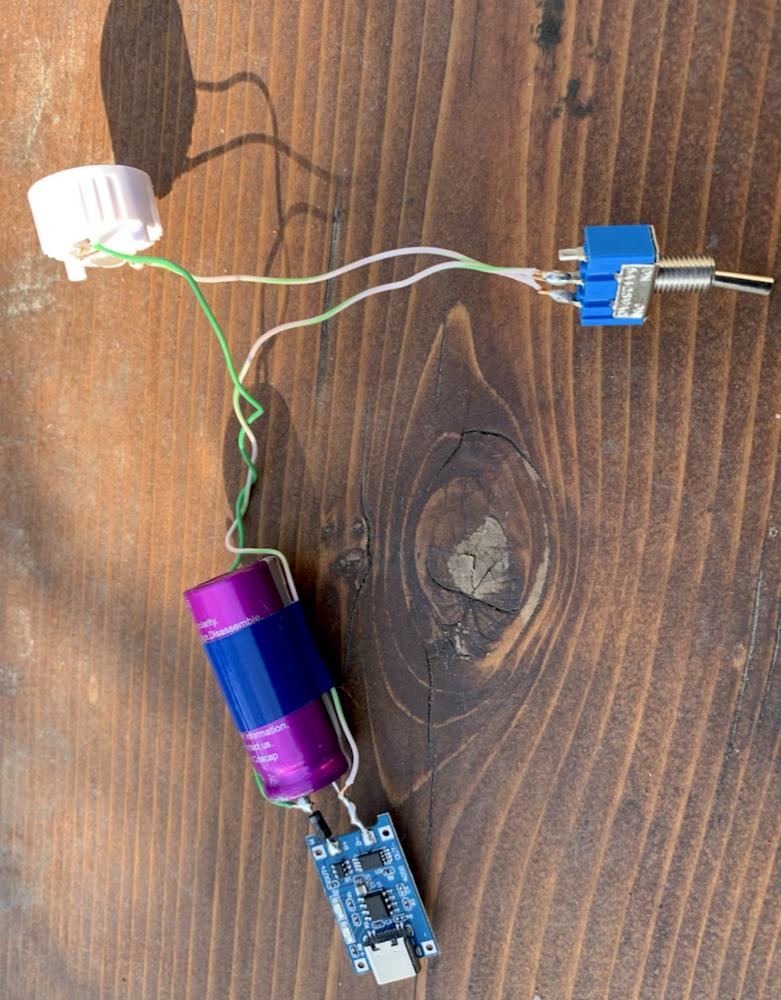

<!DOCTYPE html>
<h1>Batteryless Bicycle Headlight</h1>

<a href="README.md"> ⬆️</a> | <a href="batterylessbikeheadlight.md#Introduction">Introduction</a> | <a href="batterylessbikeheadlight.md#partslist">Parts Required</a> | <a href="batterylessbikeheadlight.md#assembly">Assembly</a>

<h1 id="introduction">Introduction</h1>                                                                         

 The widespread adoption of bicycles is essential for reducing the carbon impact of transportation.  Dutch design culture is at the fore of integrating bicycle-use into daily life.  One problem with the use of bicycles year-round or at every time of day, is being seen in the dark -- particularly during the winter in northern climates.  Bicycles would benefit from a cheap DIY sustainable lighting solution for safer travelling. The batteryless, hybrid supercapacitor approach can really score here -- 500,000x recharges. The bicycle headlight circuit on this page is similar to the <a href="https://github.com/bksutherland/GreenTechHackathon/blob/main/batterylessbiketaillight.md">bicycle taillight project</a> except the design is for a more directional beam, it requires a brighter LED and a larger batteryless power supply.  For the enclosure, it is useful to find an old length of plastic waterproof tube, either gas or water.   The recipe makes use of the larger, 1100F hybrid supercapacitor, a Seiko 1/3/5W warm white LED, a TP4056, a resistor and a schottky 1N4004 diode. Unlike batteries, supercapacitor voltages are minimally affected by temperatures above -25 °C.   

<h1 id="partslist">Parts Required</h1> 

To build this project you will need:
<ul>
  <li>1100F 4V cds Hybrid Supercapacitor (or similar capacity from a different manufacturer)</li>
  <li>1 Seiko 1/3/5 Watt warm white LEDs</li> </li>
  <li>LED reflector and plastic insert (optional, can be bought in bulk)</li>
  <li>TP4056 lithium ion battery charger (can be harvested from an old battery bank or brick or purchased new for < $1)</li>
  <li>Schottky diode - IN4004 or equivalent</li>
  <li>High wattage resistor (more than 1/4 W), 20-100 ohms, to adjust the run time/brightness. Could be a negative coefficient thermistor, whose resistance approaches zero as it heats up.</li>
  <li>Switch, preferably high wattage.  A small, low wattage switch is good for testing, but it might not last long, the leads tend to spot weld themselves if there isn't any regulation (resistor) reducing the surge current.</li>
</ul>

<h1 id="assembly">Assembly</h1> 

The assembly involves attaching a diode to the B+ pin of the TP4046, and the other end to the positive lead of the hybrid supercapacitor.  The negative lead attaches to B-.  This completes the charging system for the capacitor storage, and you could test it at this point.  When the TP4056 reaches 4.2V, less 0.4V for the diode drop (3.8V), it will cease charging the hybrid supercapacitor, the blue ID will light showing charging is finished.   Now you will want to attach a positive and negative wire to these other wires, in front of the diode. The positive wire goes into the switch, then switch to a resistor, then to the positive foot of the Seiko LED.  The negative wire attaches to the negative foot of the Seiko LED.  While designs vary, the negative foot is often notched and there is a + sign on the positive foot if you look carefully.  You can also establish the positive and negative leads of the LED just by testing it out with a battery or power supply.  

    

     

    
Treat this as an experimental project.   This hybrid supercapacitor although being less than 5 volts, can source enough current to melt insulation, make smoke, and potentially cause a fire, and the bike headlight use-application can involve a lot of movement and vibration.  Don't leave this unattended during charging, and make sure it is sufficiently insulated with tape and epoxy to work safely before strapping it onto a bike, riding with it in the rain, carrying it in a pocket, dropping it in a bag with keys, etc. 

</html>
