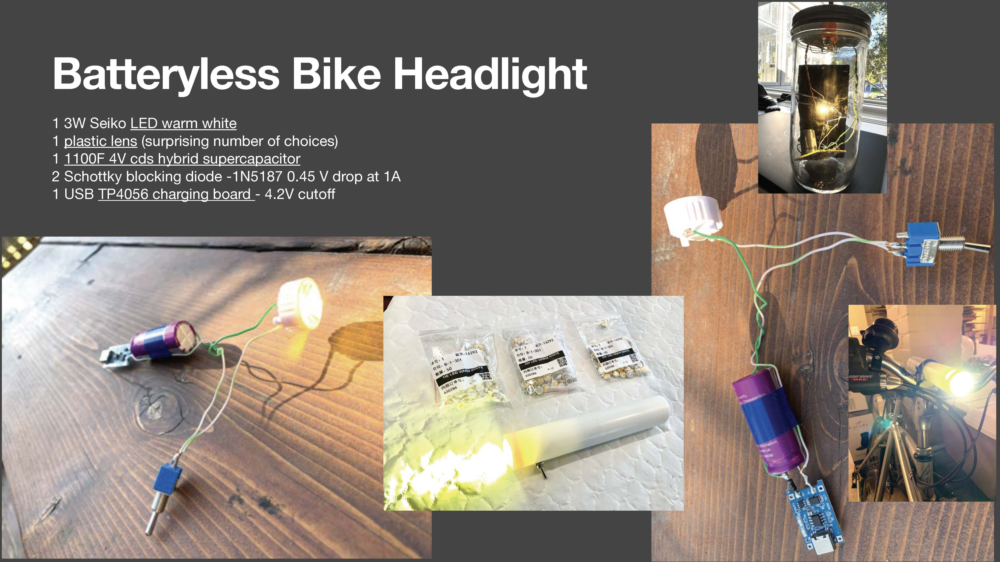

<!DOCTYPE html>
<h1>Batteryless Bicycle Headlight</h1>

<a href="README.md"> ⬆️</a> | <a href="batterylessbikeheadlight.md#Introduction">Introduction</a> | <a href="batterylessbikeheadlight.md#partslist">Parts Required</a> | <a href="batterylessbikeheadlight.md#assembly">Assembly</a>

<h1 id="introduction">Introduction</h1>                                                                         

 The widespread adoption of bicycles is essential for reducing the carbon impact of transportation.  Dutch design culture is at the fore of integrating bicycle-use into daily life.  One problem with the use of bicycles year-round or at every time of day, is being seen in the dark -- particularly during the winter in northern climates.  Bicycles would benefit from a cheap DIY sustainable lighting solution for safer travelling. The batteryless, hybrid supercapacitor approach can really score here -- 500,000x recharges, and they aren't affected by cold like batteries. The bicycle headlight circuit on this page is similar to the <a href="https://github.com/bksutherland/GreenTechHackathon/blob/main/batterylessbiketaillight.md">bicycle taillight project</a> except the design is for a more directional beam, it requires a brighter LED and a larger batteryless power supply.  For the enclosure, it is useful to find an old length of plastic waterproof tube, either gas or water.   The recipe makes use of the larger, 1100F hybrid supercapacitor, a Seiko 1/3/5W warm white LED, a TP4056, a resistor and a schottky 1N4004 diode. Unlike batteries, supercapacitor voltages are minimally affected by temperatures above -25 °C.

<h1 id="partslist">Parts Required</h1> 

Parts text

<h1 id="assembly">Assembly</h1> 

Assembly

</html>
