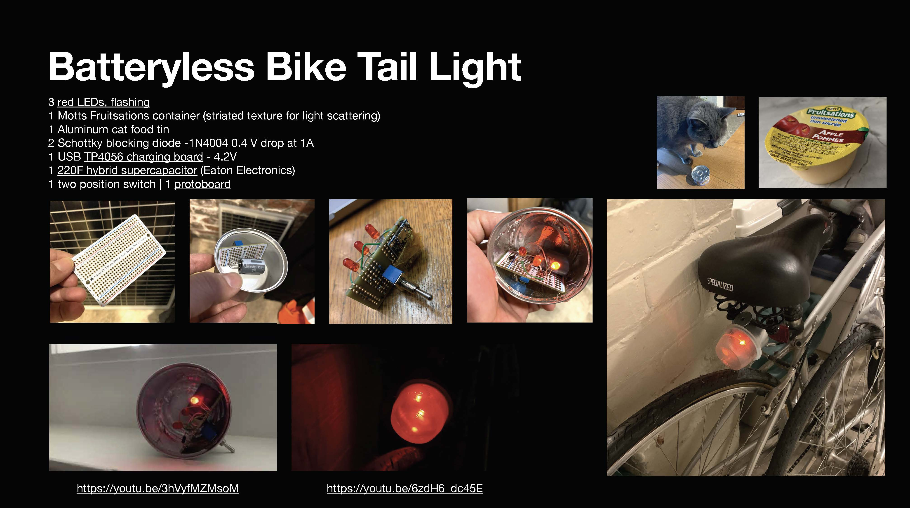

<!DOCTYPE html>
<h1>Batteryless Bicycle Tail Light</h1>

<a href="README.md"> ⬆️</a> | <a href="batterylessbiketaillight.md#Introduction">Introduction</a> | <a href="batterylessbiketaillight.md#partslist">Parts Required</a> | <a href="batterylessbiketaillight.md#assembly">Assembly</a>

<h1 id="introduction">Introduction</h1>                                                                         

A bicycle is a must for reducing the carbon impact of transportation and Dutch design culture is really at the fore of integrating bicycle-use into daily life.  The use of bicycles year-round and at any time of day is impeded by darkness, making bright lighting desirable to reduce fatalities.   This recipe makes use of one hybrid supercapacitor, an old tuna tin, an applesauce container, and some blinky red LEDs.

<h1 id="partslist">Parts Required</h1> 

Parts text

<h1 id="assembly">Assembly</h1> 

Assembly

</html>
