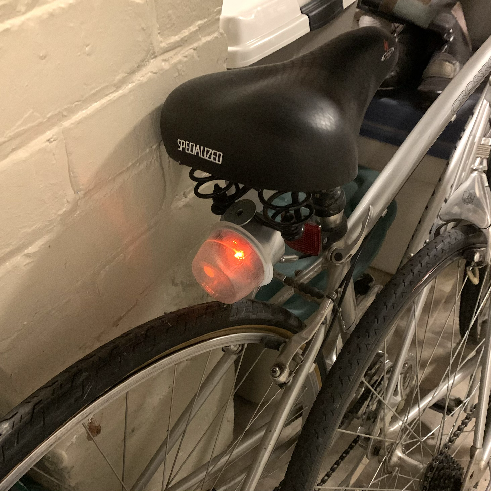
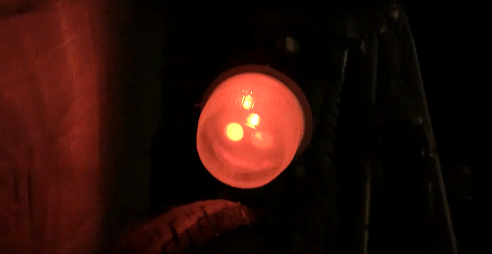
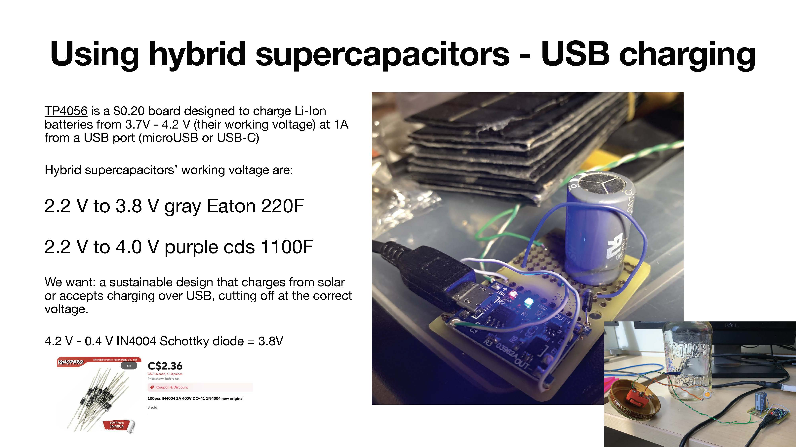
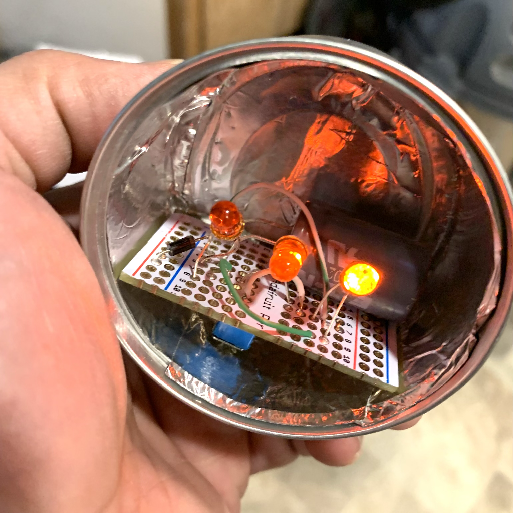
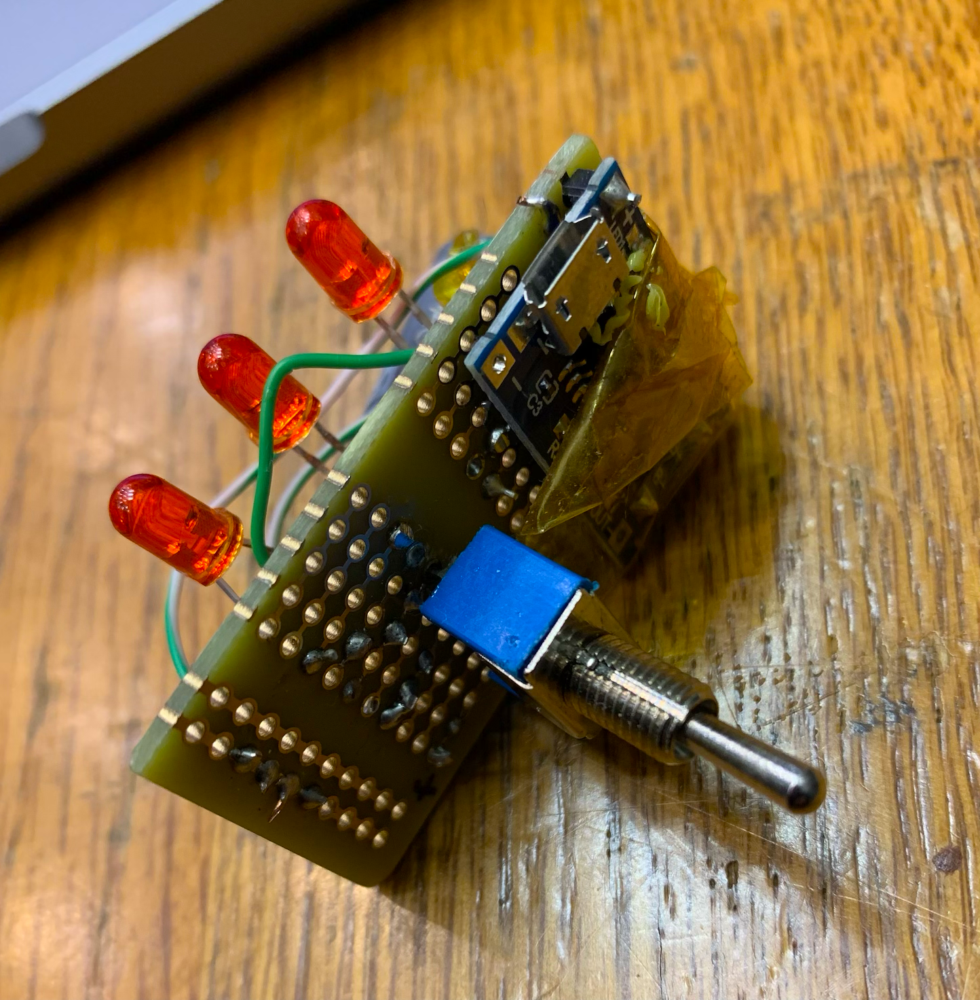
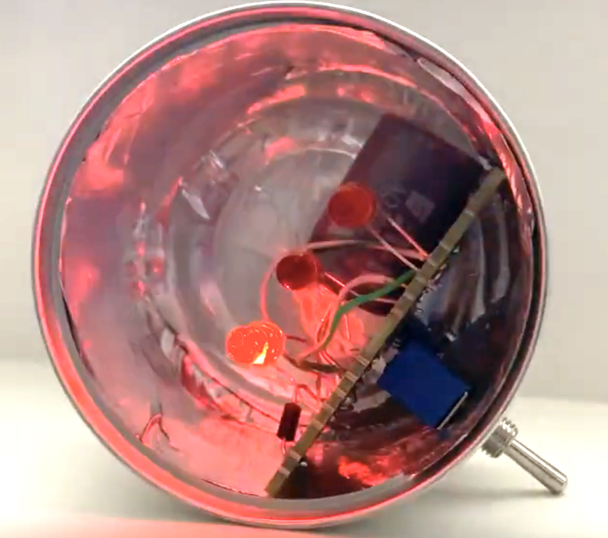

<!DOCTYPE html>
<h1>Batteryless Bicycle Tail Light</h1>

<a href="README.md"> ⬆️</a> | <a href="batterylessbiketaillight.md#Introduction">Introduction</a> | <a href="batterylessbiketaillight.md#partslist">Parts Required</a> | <a href="batterylessbiketaillight.md#assembly">Assembly</a>

<h1 id="introduction">Introduction</h1>

 
[Click the image to view the video]

A bicycle is a must for reducing the carbon impact of transportation and Dutch design culture, along with many others is at the fore of integrating bicycle-use into daily life.  One current problem with the use of bicycles year-round and at any time of day however, is the use after dark particularly during the winter in northern climates, making brighter, more sustainable lighting desirable for safer travelling.  This is where the hybrid supercapacitor can really score -- 500,000x recharges, it isn't affected by cold like batteries.  This tail light is made from ewaste and a few cheap electronics components. The recipe makes use of one hybrid supercapacitor, an old tuna tin, an applesauce container, and some blinky red LEDs.  Unlike batteries, supercapacitor voltages are minimally affected by extreme cold.

<h1 id="partslist">Parts Required</h1> 
<ul>
  <li>Small cat food tin</li>
  <li>Applesauce container (I discovered this is the right size to clip on to the tuna can, with striated lines in the plastic to scatter light)</li>
  <li><a href="https://www.adafruit.com/product/589">Small protoboard</a> or cut a large one</li>
  <li>TP4056 USB recharger (about twenty cents new) or you can recover them free as ewaste from discarded battery banks, power blocks or vaping units.  Be careful obviously not to pierce old lithium ion batteries during disassembly - do it outside!</li>
  <li>1N4004 Schottky diode or similar - the cutoff voltage of the TP4056 charger is 4.2V.  By inserting a Schottky diode in the circuit that takes 0.4V we arrive at the cutoff voltage required by the hybrid supercapacitor - 3.8V </li>
  <li><a href="https://www.eaton.com/content/dam/eaton/products/electronic-components/resources/data-sheet/eaton-supercapacitor-hybrid-cylindrical-cells-data-sheet.pdf"
>Eaton 220F hybrid supercapacitor</a> (HSL variety, good to - 25C)</li>
  <li>blinking red LEDs, 3V</li>
</ul>
<h1 id="assembly">Assembly</h1> 

This shows the board, where the hybrid supercapacitor is charged by the TP4056 via a diode.  Ordinary lithium ion batteries charge between 3.7V and 4.2V, the hybrid supercapacitors go between 2.2V and 3.8V.  Like in the public radio project, the diode reduces the 4.2V to about 3.9V so the USB charger only fills the hybrid supercapacitor until it is full then the blue light showing finished blinks on.  As supercapacitors charge much faster than batteries, this will become "full" much faster, an added benefit -- fast charging!

It is important that the USB port face the LED direction.  That way it's just a case of popping the applesauce cover off to recharge it.   You could also add a 3.5 V solar panel if you lock up your bike outdoors, to recharge the light.

</html>
