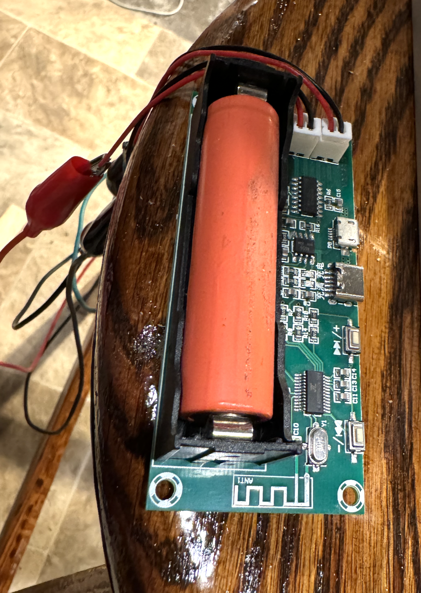
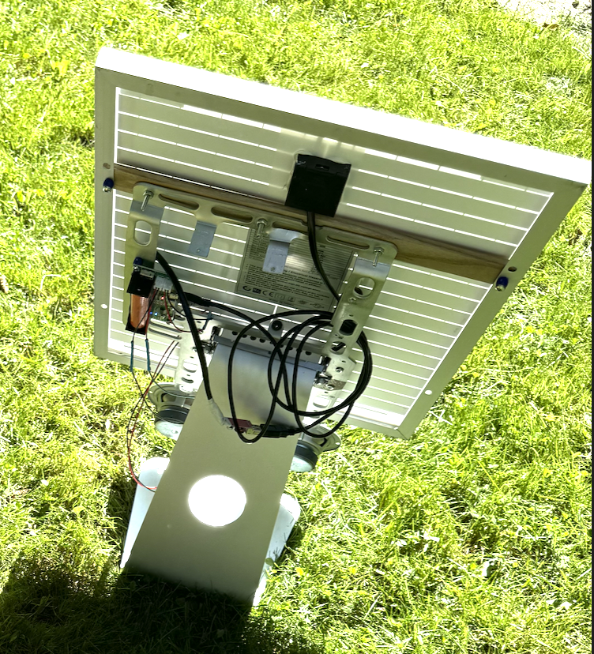

<!DOCTYPE html>
<h1 id="top">Bluetooth Stereo From eWaste</h1>

<a href="README.md"> ⬆️</a> | <a href="bluetoothewastestereo.md#Introduction">Introduction</a> | <a href="bluetoothewastestereo.md#partslist">Parts Required</a> | <a href="bluetoothewastestereo.md#assembly">Assembly</a>

<h1 id="introduction">Introduction</h1>                                                                         

The Bluetooth stereo from eWaste is a singularly low cost construction.  It uses an old iMac aluminum frame and foot, a solar panel, recycled car speakers, and a combination 18650 battery charger/bluetooth speaker amplifier.

<h1 id="partslist">Parts Required</h1> 

  <ul>
    <li>20W 12 Volt solar panel</li>
        <li>12V -> 5V USB voltage converter</li>
        <li>[PAM8403]([https://www.aliexpress.com/item/1005003399765292.html]) battery charger and Bluetooth speaker amplifier</li>
        <li>18650 battery (from ewaste)</li>
        <li>iMac 27" aluminum foot (from eWaste)</li>
        <li>high fidelity speakers (from wrecked luxury cars)</li>
  </ul>

<h1 id="assembly">Assembly</h1> 

Two ways of attaching the solar panel securely to the iMac frame: short screws into a thin piece of hardwood from the back, or into a larger piece of hardwood from the sides with long screws on either side.  The battery charger and Bluetooth speaker amplifier has holes in the circuit board in either end that can attach with small bolts through corresponding holes in the iMac frame, of via screws into the back of the wood.   
  
To charge the board, solder the 12-5V USB voltage converter to the solar panel as in the solar briefcase project.  Place a recycled 18650 in the battery slot, attach a USB-A from the converter to the mini USB input of the battery charger.  The converter LED glows red when it has a voltage, and the battery charger shows red while charging, and green when full.  

Pair your streaming media device with the bluetooth device to hear it through the speakers.   The battery holds 2-3h of charge, so after dark, the stereo will continue for hours! 

</html>
