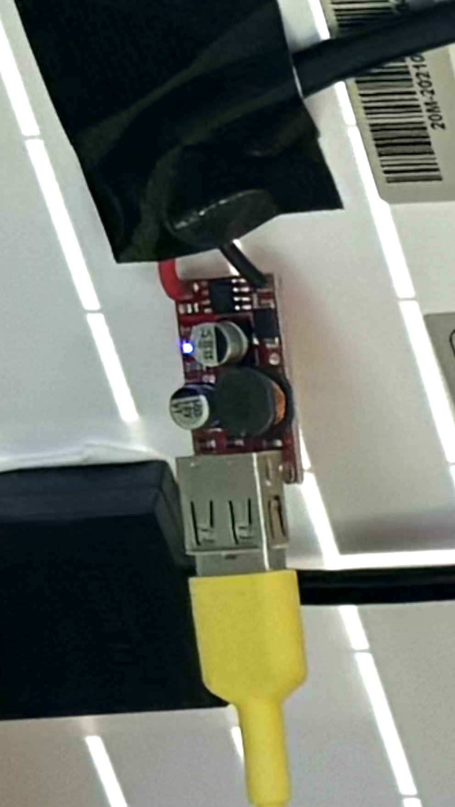
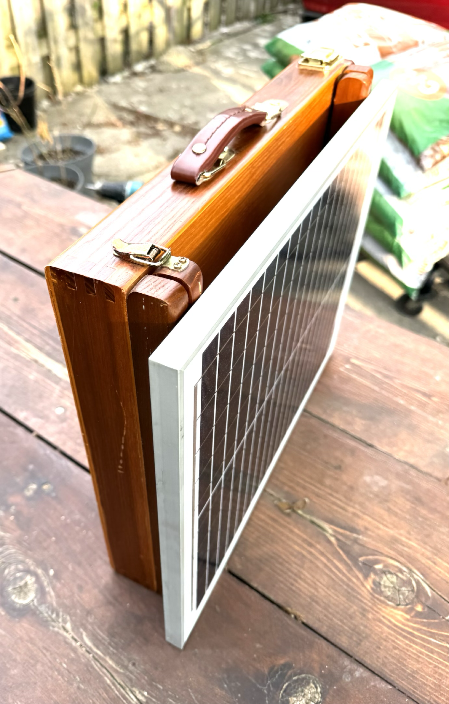
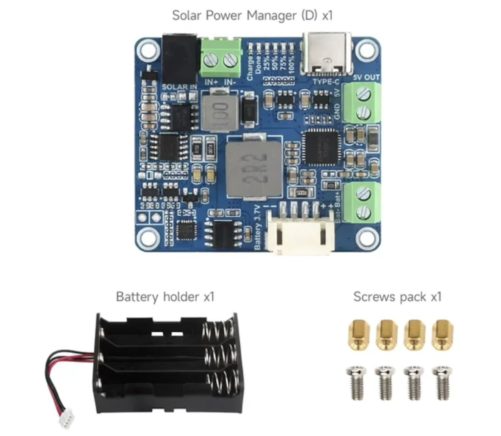

<!DOCTYPE html>
<h1 id="top">Portable Solar Office</h1>

<a href="README.md"> ⬆️</a> | <a href="portablesolaroffice.md#Introduction">Introduction</a> | <a href="portablesolaroffice.md#partslist">Parts Required</a> | <a href="portablesolaroffice.md#assembly">Assembly</a>

<h1 id="introduction">Introduction</h1>                                                                         

The portable solar powered office concept is about powering a laptop from ambient energy briefcase which doubles as a solar charger through a USB connection.  With a high efficiency laptop, you can use this device to charge the battery of a laptop, maintain it working with enough power that its battery doesn't discharge, or charge a backup power array of recycled 18650 lithium polymer batteries to act as a supplement.

<h1 id="partslist">Parts Required</h1> 

<ul>
  <li>20W solar panel</li>
  <li><a href="https://www.aliexpress.com/item/1005005614895112.html">12 - 5V USB power conversion circuit</a> for charging smartphones in the car  
  

</li>
  <li>artist's easel-briefcase  
  
,
</li>
</ul>

<h1 id="assembly">Assembly</h1> 

Attach the solar panel to the struts which normally hold up the frame for an artist's canvas.  Solder the 12 V power leads coming out the back to the 5V USB conversion circuit. 

  In full sun, plugging in a laptop which charges from USB will stop the battery from discharging, particularly for a high efficiency ARM laptop that only uses 8W for web browsing.  The lightweight briefcase is also easy to change direction as the sun moves, and the USB tether wire makes it possible for the computer user be in shade while the briefcase is in sun.

For additional energy storage, consider using a maximum power point tracking/transfer (<a href="https://en.wikipedia.org/wiki/Maximum_power_point_tracking">MPPT</a>) board like the <a href="https://www.waveshare.com/solar-power-manager-d.htm">Waveshare Solar Power Manager</a>, which can cache electricity to three 18650 lithium ion batteries commonly extractable as ewaste from discarded laptop batteries.  Maximum power point transfer squeezes the most power produced from the panel under variable lighting conditions, ensuring you are getting the most solar energy transferred whether you choose to charge the 18650 batteries from eWaste or the laptop battery.

  

</html>
